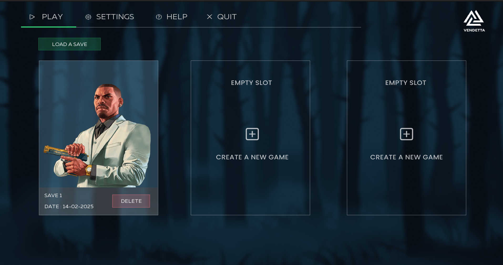
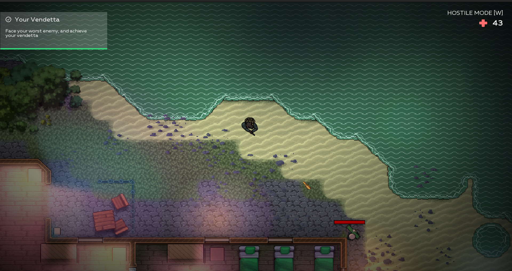
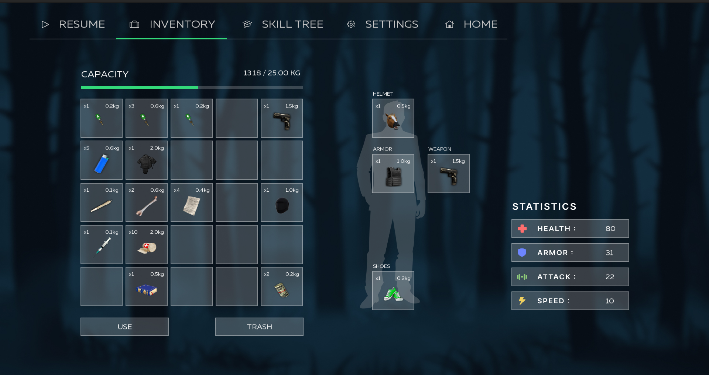
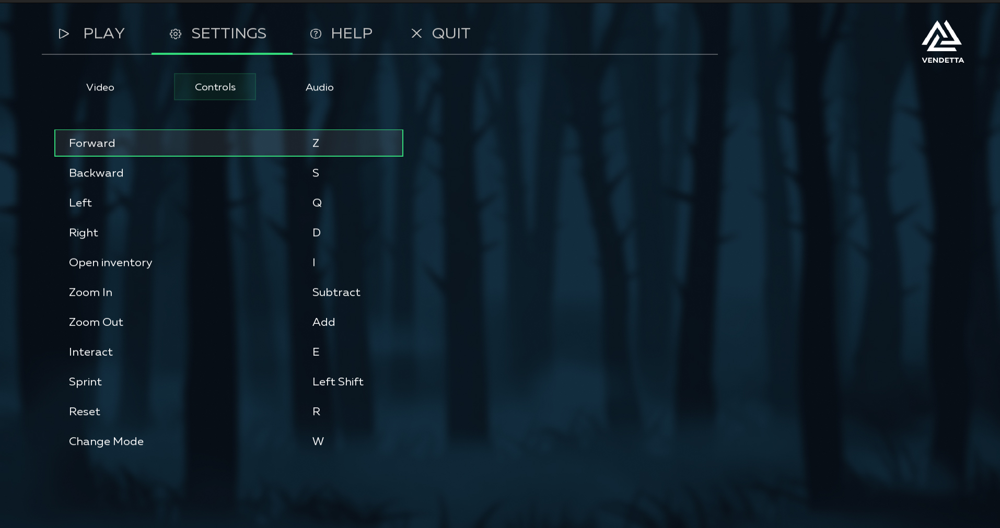
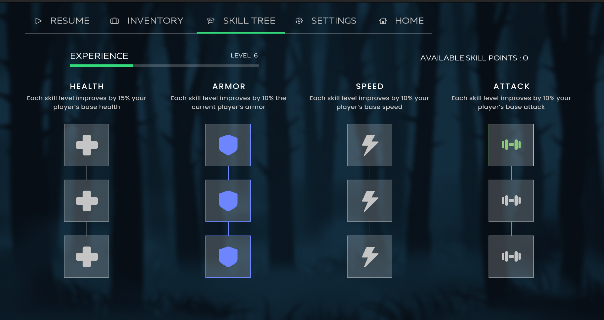
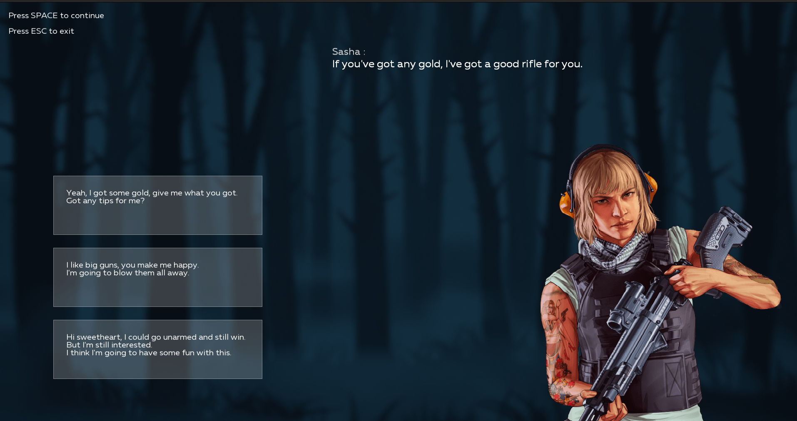

# README for Vendetta Project

## Introduction

Vendetta is an immersive Role-Playing Game (RPG) that offers players a rich narrative experience in a cohesive universe. Players embark on an epic journey, taking on the role of a unique character who evolves through various quests and challenges. With its engaging combat system and interactive storytelling, Vendetta provides an entertaining gaming experience that combines strategic gameplay with narrative depth.

## Features

### Core Gameplay
- **Dynamic Combat System**: Engaging player-versus-environment battles
- **Character Progression**: Deep skill tree and leveling system
- **Interactive Dialogue System**: Rich storytelling through character interactions
- **Mini-Games**: Various side activities to diversify gameplay experience

### Player Systems
- **Inventory Management**: Comprehensive item and equipment system
- **Skill System**: Customizable character abilities and progression
- **Quest System**: Multiple mission types and story progression
- **Save System**: Multiple save slots for game progression

### Technical Features
- **Customizable Controls**: Fully remappable control scheme
- **Advanced Graphics Settings**: Adjustable video options for optimal performance
- **Audio Settings**: Customizable sound levels for music, effects, and dialogue
- **Smooth Camera System**: Dynamic camera control for improved gameplay experience

## Game Overview


### Combat System


### Inventory System


### Settings Interface


### Skill TRee Interface


### Dialogue System


## Getting Started

### Prerequisites

Ensure you have the following installed:
- SFML library
- A C compiler (GCC recommended)
- Make

### Installation

```bash
git clone git@github.com:Haloys/Vendetta.git
cd Vendetta
```

```bash
make
```

```bash
./my_rpg
```
